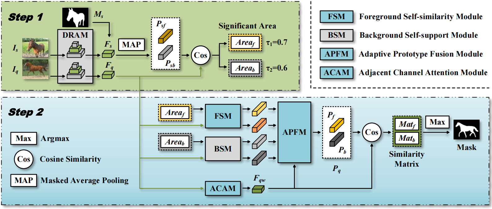

# QSM: Self-similarity Guided Query Prototyping for Robust Cross-Domain Few-shot Semantic Segmentation

The codebase contains the official code of our paper published in Visual Computer, 2025.

## Introduction

The goal of the Cross-Domain Few-shot Semantic Segmentation (CD-FSS) task is to train a generalizable model on the source domain dataset for the segmentation of multiple target domain datasets. We propose a Query Self-similar Matching (QSM) framework to implement CD-FSS. We suggest paying more attention to the query image itself, so as to solve the problem of intra-class individual differences in CD-FSS.

<p align="middle">
    
</p>


## Datasets preparation

The CD-FSS evaluation benchmark includes datasets: PASCAL VOC2012, Deepglobe [1], ISIC2018 [2], Chest X-ray [3], and FSS-1000 [4].


### Download

You can follow [PATNet](https://github.com/slei109/PATNet) to prepare the source domain and target domain datasets.


#### Source domain (train & val dataset) :

* **PASCAL VOC2012**:

    Download PASCAL VOC2012 devkit :
    ```bash
    wget http://host.robots.ox.ac.uk/pascal/VOC/voc2012/VOCtrainval_11-May-2012.tar
    ```
    Download PASCAL VOC2012 SDS extended mask annotations from [[Google Drive](https://drive.google.com/file/d/10zxG2VExoEZUeyQl_uXga2OWHjGeZaf2/view?usp=sharing)].


#### Target domains (test datasets) : 

* **Deepglobe**:

    Home: http://deepglobe.org/

    Direct: https://www.kaggle.com/datasets/balraj98/deepglobe-land-cover-classification-dataset
    
    Preprocessed Data: https://drive.google.com/file/d/10qsi1NRyFKFyoIq1gAKDab6xkbE0Vc74/view?usp=sharing

* **ISIC2018**:

    Home: http://challenge2018.isic-archive.com

    Direct (must login): https://challenge.isic-archive.com/data#2018

* **Chest X-ray**:

    Home: https://www.ncbi.nlm.nih.gov/pmc/articles/PMC4256233/

    Direct: https://www.kaggle.com/datasets/nikhilpandey360/chest-xray-masks-and-labels

* **FSS-1000**:

    Home: https://github.com/HKUSTCV/FSS-1000

    Direct: https://drive.google.com/file/d/16TgqOeI_0P41Eh3jWQlxlRXG9KIqtMgI/view


#### Prepare models for training (to train your own model) : 
* Pretrained model : resnet50.pth ([Google drive](https://drive.google.com/file/d/11yONyypvBEYZEh9NIOJBGMdiLLAgsMgj/view?usp=sharing))
* Baseline model trained in original SSP : Ori_SSP_trained_on_VOC.pth ([Google drive](https://drive.google.com/file/d/1Cqqsqy1ojc-CbI7y2in--JFa2e1CCN61/view?usp=drive_link)||[Baidu Netdisk](https://pan.baidu.com/s/1kcSekjSAa1KYyK7gzrPDAw?pwd=b2nt))

  (Note: Please place the "Ori_SSP_trained_on_VOC.pth"under the directory "./outdir/", and put the "resnet50.pth" under the directory "./outdir/".)


### File Organization

```
    data                                                  # datasets directory
       ├── VOCdevkit/                                              # PASCAL VOC2012 devkit
       │    └── VOC2012/            
       │        ├── Annotations/
       │        ├── ImageSets/
       │        ├── ...
       │        └── SegmentationClassAug/
       ├── chest/           
       │    └── LungSegmentation/                                  # lung benchmark
       │
       ├── fss/
       │    └── FSS-1000/                                          # fss benchmark
       │        ├── abacus/   
       │        ├── ...
       │        └── zucchini/
       ├── ISIC/
       │    └── ISIC/                                              # ISIC benchmark
       └── deepglobe/
            └── Deepglobe/                                         # deepglobe benchmark


    QSM                                                   # Current (project) directory
       ├── assets/                                                 # Picture of our framework
       ├── common/                                                 # Logger & Evaluate & Visualization
       ├── data_util/                                              # Dataloader
       ├── model/                                                  # Main modules of our QSM
       ├── outdir/                                               # Pretrained models and output models 
       │    ├── Ori_SSP_trained_on_VOC.pth
       │    ├── resnet50.pth
       │    ├── QSM_pth/
       │        ├── QSM_best.pth                                          # If you just want to test
       │        ├── last_model.pth                                        # Train your own model
       │        └── best_model.pth                                        # Train your own model
       └── util/                                                  # Some compute functions
```

## Run the code

### Training
> ```bash
> python train.py 
> ```
Our QSM model is trained on a single NVIDIA RTX A5000 (24G) GPU, and it takes 4 hours for training.


### Testing
> ```bash
> python test.py
> ```
Also, you can download our trained QSM model directly for testing  (if you just want to test) :
* our trained QSM model : QSM_best.pth ([Baidu Netdisk](https://pan.baidu.com/s/1gVKFi-f7mT5yspGWDObDYw?pwd=xztx))

  (Note: Please place the "QSM_best.pth" under the directory "./outdir/QSM_pth/".)


## Acknowledgement

Our codebase is built based on [SSP's](https://github.com/fanq15/SSP) and [DRANet's](https://github.com/Matt-Su/DR-Adapter) baseline code. We borrow [PATNet's](https://github.com/slei109/PATNet) evaluation protocol for the different dataset. We appreciate the work of SSP, PATNet, DRANet and other FSS & CD-FSS works for their great contributions.


## Citation

```bibtex
@article{yi2025QSM,
  title={QSM: Self-similarity Guided Query Prototyping for Robust Cross-Domain Few-shot Semantic Segmentation},
  author={Jianbing Yi, and Chenghua Tang, et al.},
  journal={Visual Computer},
  year={2025}
}
```


## References

[1] Demir, I., Koperski, K., Lindenbaum, D., Pang, G., Huang, J., Basu, S., Hughes, F., Tuia, D., Raskar, R.: Deepglobe 2018: A challenge to parse the earth through satellite images. In: The IEEE Conference on Computer Vision and Pattern Recognition (CVPR) Workshops (June 2018)Li, X., Wei, T., Chen, Y.P., Tai, Y.W., Tang, C.K.: Fss-1000: A 1000-class dataset for few-shot segmentation. In: Proceedings of the IEEE/CVF Conference on Computer Vision and Pattern Recognition (CVPR). pp. 2869–2878 (2020)

[2] Codella, N., Rotemberg, V., Tschandl, P., Celebi, M.E., Dusza, S., Gutman, D., Helba, B., Kalloo, A., Liopyris, K., Marchetti, M., et al.: Skin lesion analysis toward melanoma detection 2018: A challenge hosted by the international skin imaging collaboration (isic). arXiv preprint arXiv:1902.03368 (2019)

[3] Candemir, S., Jaeger, S., Palaniappan, K., Musco, J.P., Singh, R.K., Xue, Z., Karargyris, A., Antani, S., Thoma, G., McDonald, C.J.: Lung segmentation in chest radiographs using anatomical atlases with nonrigid registration. IEEE transactions on medical imaging 33(2), 577–590 (2013)

[4] Li, X., Wei, T., Chen, Y.P., Tai, Y.W., Tang, C.K.: Fss-1000: A 1000-class dataset for few-shot segmentation. In: Proceedings of the IEEE/CVF Conference on Computer Vision and Pattern Recognition (CVPR). pp. 2869–2878 (2020)

[5] Su, Jiapeng., Fan, Q., Pei W.,Guangming Lu G., Chen F.: Domain-Rectifying Adapter for Cross-Domain Few-Shot Segmentation. In: Proceedings of the IEEE/CVF Conference on Computer Vision and Pattern Recognition (CVPR), 2024 
